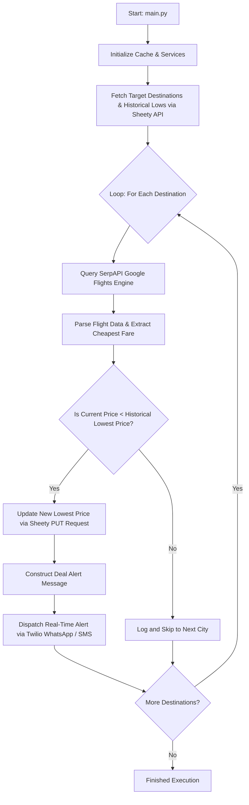

# ✈️ FlightSniper — Automated Flight Deal Tracker & Alert Engine

[](https://python.org)
[](https://serpapi.com)
[](https://sheety.co)
[](https://twilio.com)
[](LICENSE)

An intelligent, multi-module Python automation service that monitors global flight prices against target budgets stored in Google Sheets. When a price drops below historical thresholds, **FlightSniper** updates the database and instantly dispatches real-time low-fare alerts via **WhatsApp** or **SMS**.

---

## 🌟 Key Features

* **Automated Price Discovery:** Queries live Google Flights pricing via SerpAPI across dynamic 6-month departure and return date windows.
* **Cloud Database Synchronization:** Interfaces with Google Sheets through the Sheety REST API using secure HTTP Basic Authentication.
* **Instant Multi-Channel Alerts:** Automatically crafts and fires actionable deal alerts to your mobile device via Twilio (WhatsApp Sandbox & SMS).
* **Intelligent API Caching:** Leverages `requests_cache` to cache flight queries for 1 hour to preserve API free-tier quotas, while strictly bypassing cache for Google Sheets to guarantee real-time data integrity.
* **Modular OOP Architecture:** Cleanly decoupled responsibilities across dedicated services for data retrieval, flight searching, data parsing, and notifications.

---

## 🏗️ Architecture & Workflow



---

## 📁 Repository Structure

```text
FlightSniper/
├── main.py                  # Program entry point, pipeline orchestrator & caching setup
├── data_manager.py          # Google Sheets integration (GET destinations, PUT new price records)
├── flight_search.py         # SerpAPI client managing Google Flights round-trip search queries
├── flight_data.py           # Domain data models & response parser (find_cheapest_flight)
├── notification_manager.py  # Twilio client managing WhatsApp and SMS alert delivery
├── flowchart.txt            # ASCII architectural execution lifecycle diagram
└── README.md                # Project documentation package
```

---

## ⚙️ Module Breakdown

| Module | Responsibility | Key Classes & Functions |
| :--- | :--- | :--- |
| `main.py` | Orchestrates pipeline loop, date math (`datetime`, `timedelta`), and caching policy. | Cache setup, destination iteration, alert trigger |
| `data_manager.py` | Communicates with Sheety API over HTTPS using HTTP Basic Authentication. | `DataManager.get_destination_data()`, `update_lowest_price()` |
| `flight_search.py` | Prepares parameter payloads and queries Google Flights via SerpAPI. | `FlightSearch.check_flights()` |
| `flight_data.py` | Normalizes flight JSON structures into structured data objects. | `FlightData`, `find_cheapest_flight()` |
| `notification_manager.py` | Dispatches outbound SMS texts and WhatsApp messages via Twilio REST API. | `NotificationManager.send_whatsapp()`, `send_sms()` |

---

## 🚀 Getting Started

### Prerequisites

* **Python 3.8+** installed on your system.
* A **Sheety Account** connected to a Google Sheet with target destinations (`City`, `IATA Code`, `Lowest Price`).
* A **SerpAPI Key** for accessing Google Flights search endpoints.
* A **Twilio Account** with an active virtual phone number and WhatsApp sandbox enabled.

### 1. Clone the Repository

```bash
git clone https://github.com/dharmendra779089/FlightSniper.git
cd FlightSniper
```

### 2. Create and Activate a Virtual Environment

```bash
python -m venv venv

# On Windows:
venv\Scripts\activate

# On macOS/Linux:
source venv/bin/activate
```

### 3. Install Dependencies

```bash
pip install requests requests-cache python-dotenv twilio
```

---

## 🔐 Environment Configuration

Create a `.env` file in the root directory and populate your credentials:

```ini
# Sheety API Credentials
SHEETY_PRICES_ENDPOINT="https://api.sheety.co/your_username/your_project/prices"
SHEETY_USERNAME="your_sheety_username"
SHEETY_PASSWORD="your_sheety_password"

# SerpAPI Flight Search
SERPAPI_API_KEY="your_serpapi_key"

# Twilio Alert Credentials
TWILIO_SID="your_twilio_account_sid"
TWILIO_AUTH_TOKEN="your_twilio_auth_token"
TWILIO_VIRTUAL_NUMBER="+1234567890"
TWILIO_WHATSAPP_NUMBER="+14155238886"
TWILIO_VERIFIED_NUMBER="+91XXXXXXXXXX"
```

### Google Sheet Format

Your Google Sheet connected to Sheety should contain the following column headers:

| City | IATA Code | Lowest Price |
| :--- | :--- | :--- |
| Paris | CDG | 55 |
| Frankfurt | FRA | 42 |
| Tokyo | HND | 485 |
| New York | JFK | 260 |

---

## 🏃 Running the Application

Execute the main orchestrator script:

```bash
python main.py
```

### Sample Console Output

```text
Getting flights for Paris...
Paris: GBP 48
Lower price flight found to Paris! Sending alert...
WhatsApp Sent! SID: SM9b4d8120fa2e452eb8896a2e9b049d11

Getting flights for Tokyo...
Tokyo: GBP 510

Getting flights for New York...
New York: GBP 245
Lower price flight found to New York! Sending alert...
WhatsApp Sent! SID: SM1c8f39a04f2910ba98d76a3e110c7490
```

### 📱 Sample WhatsApp / SMS Alert

```text
Low price alert! Only GBP 48 to fly from LHR to CDG, on 2026-09-15 until 2026-10-15.
```

---

## 💡 Caching Strategy & Quota Protection

To avoid exhausting free-tier API quotas during testing and scheduled runs, **FlightSniper** applies an intelligent caching policy via `requests_cache`:
* **SerpAPI Requests:** Cached locally in `flight_cache.sqlite` for **3600 seconds (1 hour)**. Repeated queries within the hour return instantaneous cached responses.
* **Sheety API Requests:** Tagged with `requests_cache.DO_NOT_CACHE`, ensuring that your Google Sheets spreadsheet always receives real-time reads and writes.

---

## 👤 Author

* **Dharmendra Kumar**  
  * **GitHub:** [@dharmendra779089](https://github.com/dharmendra779089)  
  * **Portfolio:** [dharmendra779089.github.io](https://dharmendra779089.github.io)  
  * **LinkedIn:** [dharmendra-kumar](https://linkedin.com/in/dharmendra-kumar-925770222)

---

## 📄 License

This project is licensed under the [MIT License](LICENSE).
